+++
date = '2025-01-19T04:53:00Z'
title = 'Bitarray vs Boolean[]'
weight = 100
+++

Bitarray는 boolean 데이터를 정수형에 압축하여 저장하고 bit mask로 값을 조작한다.  
메모리를 덜 사용하는 대신 비트 연산을 매번 수행하기 때문에 실행속도에서는 어느 것이 더 빠른지 직관적으로 파악하기는 어렵다.

## 가정

일반적인 x64 시스템이라고 가정하면 아래의 내용이 성립한다.

- 캐시 줄 크기: 64 바이트 단위로 메모리를 캐싱한다
- 정수 자료형 크기: 1/2/4/8 바이트 정수형을 지원한다
- 메모리 주소 단위: 1 바이트

대략적인 명령어 latency ([출처: https://www.agner.org/optimize/#manual_instr_tab](https://www.agner.org/optimize/#manual_instr_tab) Zen 3,4/IceLake)

| 명령어 | 인자 | latency |
| --- | --- | --- |
| mov | reg, reg/imm | 1
| mov | reg, mem | 2~3
| mov | mem, reg/imm | 2
| and/or/xor/shr | reg, reg/imm | 1
| not | reg | 1

`reg`는 레지스터, `mem`은 메모리 주소, `imm`은 상수를 의미한다.

## ASM 비교

### 64비트 이하

64비트 이하는 bitarray에서 하나의 `long`으로 표현할 수 있으므로 필요한 연산이 더욱 적어진다.

컴파일러와 최적화 설정에 따라 약간은 달라지겠지만 대략적인 구조는 같을 것이다.


{}
```nasm
; Assume $rbp-0x18 is n (position of bit)
; Assume $rbp-0x20 is bitarray of type long (8 byte)
; rax = bitarray & (1 << n)

mov rax, [rbp-0x20]
mov rcx, [rbp-0x18]
mov edx, 1
shl rdx, rcx
and rax, rdx
```
{}

{}
```nasm
; Assume $rbp-0x18 is n (position of bit)
; Assume $rbp-0x20 is bitarray of type long (8 byte)
; bitarray |= (1 << n)

mov rax, [rbp-0x20]
mov rcx, [rbp-0x18]
mov edx, 1
shl rdx, rcx
or rax, rdx
mov [rbp-0x20], rax
```
{}

{}
```nasm
; Assume $rbp-0x18 is n (position of bit)
; Assume $rbp-0x20 is bitarray of type long (8 byte)
; bitarray &= ~(1 << n)

mov rax, [rbp-0x20]
mov rcx, [rbp-0x18]
mov edx, 1
shl rdx, rcx
not rdx
and rax, rdx
mov [rbp-0x20], rax
```
{}

{}
```nasm
; Assume $rbp-0x18 is n (position of bit)
; Assume $rbp-0x20 is bitarray of type long (8 byte)
; bitarray ^= (1 << n)

mov rax, [rbp-0x20]
mov rcx, [rbp-0x18]
mov edx, 1
shl rdx, rcx
xor rax, rdx
mov [rbp-0x20], rax
```
{}

{}
```nasm
; Assume $rbp-0x20 is bitarray of type long (8 byte)

mov [rbp-0x20], 0
```
{}

{}
```nasm
; Assume $rbp-0x20 is bitarray of type long (8 byte)

mov [rbp-0x20], 1
```
{}



{}
```nasm
; Assume $rbp-0x18 is n (position of bit)
; Assume $rbp-0x20 is arr of type Boolean[]
; rax = arr[n]

mov rax, [rbp-0x18]
mov rax, BYTE PTR [rbp-0x20+rax]
```
{}

{}
```nasm
; Assume $rbp-0x18 is n (position of bit)
; Assume $rbp-0x20 is arr of type Boolean[]
; arr[n] = True

mov rax, [rbp-0x18]
mov BYTE PTR [rbp-0x20+rax], 1
```
{}

{}
```nasm
; Assume $rbp-0x18 is n (position of bit)
; Assume $rbp-0x20 is arr of type Boolean[]
; arr[n] = False

mov rax, [rbp-0x18]
mov BYTE PTR [rbp-0x20+rax], 0
```
{}

{}
```nasm
; Assume $rbp-0x18 is n (position of bit)
; Assume $rbp-0x20 is arr of type Boolean[]
; arr[n] = !arr[n]

mov rax, [rbp-0x18]
mov rdx, BYTE PTR [rbp-0x20+rax]
not rdx
mov BYTE PTR [rbp-0x20+rax], rdx
```
{}

{}
```nasm
; Assume $rbp-0x20 is arr of type Boolean[]

xor eax, eax
lea rdi, [rbp-0x20]
mov rcx, size_of_arr
rep stosb
```
{}

{}
```nasm
; Assume $rbp-0x20 is arr of type Boolean[]

mov eax, 1
lea rdi, [rbp-0x20]
mov rcx, size_of_arr
rep stosb
```
{}



{}
양쪽 다 메모리 fetch는 2번이다. 그러나 bitarray의 fetch가 조금 더 빠르다.

`bitarray`는 서로 독립적인 메모리 공간에서 값을 불러오기 때문에 CPU pipeline에 작업을 바로 이어서 넘겨줄 수 있다.  
하지만 `배열`은 원소의 인덱스 `n`을 완전히 불러온 후에 주소를 계산하고, 그 주소의 메모리 값을 요청하기 때문에 상대적으로 느리다.  

x64에서 주소 연산은 `base_reg + (index_reg << scale_imm) + offset_imm` 중 필요한 인자만 사용하여 수행한다.  
`_reg`는 레지스터 인자를 의미하며 `_imm`은 상수를 의미한다.  이때 `scale_imm`은 `0~3`만 가능하다.  
또한, 주소 연산은 일반 ALU가 아닌 별도의 최적화된 하드웨어를 사용한다.

**아주 대략적으로** CPU pipeline은 아래와 비슷할 것이다.

```mermaid
gantt
dateFormat ss
axisFormat %S
tickInterval 1second
    section Bitarray
    mov rax, [rbp-0x20]: a, 01, 03
    mov rcx, [rbp-0x18]: a, 00, 02
    mov edx, 1: 01, 02
    shr rdx, rcx: a, 02, 03
    and rax, rdx: a, 03, 04
    
    section Boolean[]
    mov rax, [rbp-0x18]: b, 00, 02
    mov rax, BYTE PTR [rbp-0x20+rax]: b, 02, 05
```



`Bitarray`가 조금 빠를 것으로 보인다.

덤으로 조건문을 걸게 되면 `bitarray`는 `and` 명령어의 결과를 바탕으로 `jz / jnz` 명령어를 바로 쓸 수 있지만 `배열`은 `test eax, eax`로 비트의 값을 먼저 확인해야 한다.  
하지만 컴파일러가 -O2 플래그로 컴파일해도 `test` 명령어를 항상 삽입하기 때문에 손수 어셈블리 최적화를 할 게 아니라면 의미 없다.
{}

{}


```mermaid
gantt
dateFormat ss
axisFormat %S
tickInterval 1second
    section Bitarray
    mov rax, [rbp-0x20]: a, 01, 03
    mov rcx, [rbp-0x18]: a, 00, 02
    mov edx, 1: a, 01, 02
    shl rdx, rcx: a, 02, 03
    or rax, rdx: a, 03, 04
    mov [rbp-0x20], rax: a, 03, 05
    
    section Boolean[]
    mov rax, [rbp-0x18]: b, 00, 02
    mov BYTE PTR [rbp-0x20+rax], 1: b, 02, 04
```

`Bitarray`보다 `배열`이 조금 더 빠를 것으로 보인다.
{}

{}


```mermaid
gantt
dateFormat ss
axisFormat %S
tickInterval 1second
    section Bitarray
    mov rax, [rbp-0x20]: a, 01, 03
    mov rcx, [rbp-0x18]: a, 00, 02
    mov edx, 1: a, 01, 02
    shl rdx, rcx: a, 02, 03
    not rdx: a, 03, 04
    or rax, rdx: a, 04, 05
    mov [rbp-0x20], rax: a, 04, 06
    
    section Boolean[]
    mov rax, [rbp-0x18]: b, 00, 02
    mov BYTE PTR [rbp-0x20+rax], 0: b, 02, 04
```

`Bitarray`보다 `배열`이 더 빠를 것으로 보인다.
{}

{}


```mermaid
gantt
dateFormat ss
axisFormat %S
tickInterval 1second
    section Bitarray
    mov rax, [rbp-0x20]: a, 01, 03
    mov rcx, [rbp-0x18]: a, 00, 02
    mov edx, 1: a, 01, 02
    shl rdx, rcx: a, 02, 03
    xor rax, rdx: a, 03, 04
    mov [rbp-0x20], rax: a, 03, 05
    
    section Boolean[]
    mov rax, [rbp-0x18]: b, 00, 02
    mov rdx, BYTE PTR [rbp-0x20+rax]: b, 02, 04
    not rdx: b, 04, 05
    mov BYTE PTR [rbp-0x20+rax], rdx: b, 04, 07
```

`배열`보다 `bitarray`가 더 빠를 것으로 보인다.  
{}

{}
배열 값을 전부 설정할 때 `배열`은 반드시 모든 메모리 공간에 값을 작성해야 하므로 하나의 값만 쓰면 되는 `bitarray`보다 느리다.
{}

{}
배열 값을 전부 설정할 때 `배열`은 반드시 모든 메모리 공간에 값을 작성해야 하므로 하나의 값만 쓰면 되는 `bitarray`보다 느리다.
{}


종합해보면 초기화 외에느 비슷하거나 `bitarray`가 더 느릴 것으로 보인다. C++에서는 `std::bitset / std::vector<bool>`가 있어 코드 작성에 큰 차이는 없겠지만 Python에서는 직접 비트 연산을 해줘야 하기 때문에 메모리 외에는 코드 작성도 더 번거롭다. 메모리 여유가 있다면 그냥 배열을 쓰는 것이 좋아보인다.

예시로 [백준 7667](https://www.acmicpc.net/problem/7662)에서 아래 솔루션을 bitarray로 변경하면 시간초과가 난다.

{}
```python3
#!/usr/bin/python3

import sys
def read():
    return sys.stdin.readline().rstrip()

def readInt():
    return int(sys.stdin.readline())

import heapq

for _ in range(readInt()):
    minh = []
    maxh = []
    rm = [True] * 1_000_001
    cnt = 0
    for _ in range(readInt()):
        op, val = read().split()
        if op == "I":
            k = int(val)
            heapq.heappush(minh, (k, cnt))
            heapq.heappush(maxh, (-k, cnt))
            cnt += 1
        elif val == "1":
            while len(maxh) > 0:
                _, c = heapq.heappop(maxh)
                if rm[c]:
                    rm[c] = False
                    break
        else:
            while len(minh) > 0:
                _, c = heapq.heappop(minh)
                if rm[c]:
                    rm[c] = False
                    break

    while len(maxh) > 0:
        big, c = heapq.heappop(maxh)
        if rm[c]:
            break
    else:
        print("EMPTY")
        continue

    while len(minh) > 0:
        small, c = heapq.heappop(minh)
        if rm[c]:
            break
    else:
        print("EMPTY")
        continue

    print(-big, small)
```
{}

{}
```python3
#!/usr/bin/python3

import sys
def read():
    return sys.stdin.readline().rstrip()

def readInt():
    return int(sys.stdin.readline())

import heapq

for _ in range(readInt()):
    minh = []
    maxh = []
    rm = 0
    cnt = 0
    for _ in range(readInt()):
        op, val = read().split()
        if op == "I":
            k = int(val)
            heapq.heappush(minh, (k, cnt))
            heapq.heappush(maxh, (-k, cnt))
            cnt += 1
        elif val == "1":
            while len(maxh) > 0:
                _, c = heapq.heappop(maxh)
                if rm & (1 << c) == 0:
                    rm |= (1 << c)
                    break
        else:
            while len(minh) > 0:
                _, c = heapq.heappop(minh)
                if rm & (1 << c) == 0:
                    rm |= (1 << c)
                    break

    while len(maxh) > 0:
        big, c = heapq.heappop(maxh)
        if rm & (1 << c) == 0:
            break
    else:
        print("EMPTY")
        continue

    while len(minh) > 0:
        small, c = heapq.heappop(minh)
        if rm & (1 << c) == 0:
            break
    else:
        print("EMPTY")
        continue

    print(-big, small)
```
{}

그러나 백트래킹 문제에서 탐색 기록을 저장하는 등의 복사가 많은 경우에는 bitarray가 더 빠르다. boolean 배열은 원소당 최소 1바이트를 쓰지만 bitarray는 8bit마다 1바이트를 사용하기 때문에 최소 8배 더 빨리 복사할 수 있다.

예시로 [백준 1987](https://www.acmicpc.net/problem/1987)에서 재귀 없이 동일한 풀이로 `Bitarray vs Boolean[]` 실행결과를 비교하면 다음과 같다.

{}
```python3
#!/usr/bin/python3

import sys
def read():
    return sys.stdin.readline().rstrip()

def readInts():
    return map(int, sys.stdin.readline().split())

r, c = readInts()
grid = [[ord(c) - 65 for c in read()] for _ in range(r)]
masks = [1 << i for i in range(26)]

offsets = [(-1, 0), (1, 0), (0, -1), (0, 1)]
stk = [(0, 0, masks[grid[0][0]], 1)]
res = 1
while len(stk) != 0:
    x, y, visited, cnt = stk.pop()
    res = max(res, cnt)
    for ox, oy in offsets:
        i, j = x + ox, y + oy
        if 0 <= i < r and 0 <= j < c and (visited & masks[grid[i][j]]) == 0:
            stk.append((i, j, visited | masks[grid[i][j]], cnt + 1))

print(res)
```
{}

{}
```python3
#!/usr/bin/python3

import sys
def read():
    return sys.stdin.readline().rstrip()

def readInts():
    return map(int, sys.stdin.readline().split())

r, c = readInts()
grid = [[ord(c) - 65 for c in read()] for _ in range(r)]

offsets = [(-1, 0), (1, 0), (0, -1), (0, 1)]
visited = [False] * 26
visited[grid[0][0]] = True
stk = [(0, 0, visited, 1)]
res = 1
while len(stk) != 0:
    x, y, visited, cnt = stk.pop()
    res = max(res, cnt)
    for ox, oy in offsets:
        i, j = x + ox, y + oy
        if 0 <= i < r and 0 <= j < c and not visited[grid[i][j]]:
            cpy = visited.copy()
            cpy[grid[i][j]] = True
            stk.append((i, j, cpy, cnt + 1))

print(res)
```
{}

| 풀이 | 실행시간 (ms) | 메모리 (KB) |
| --- | --- | --- |
| Bitarray | 2,900 | 111,276 |
| Boolean[] | 3,932 | 115,380 |

### 64비트 초과

`배열`은 코드가 달라지지 않지만 `bitarray`는 64비트를 넘어가면 바이트 배열로 나누어야 하므로 `배열`이 하는 주소 연산에 추가로 비트 연산까지 해야 하므로 실행속도는 `배열`이 더 빠르다.

`Bitarray get bit / set bit / clear bit / toggle bit`는 첫 2줄을 아래와 같이 변경하면 임의의 길이에도 사용할 수 있다.

```nasm
; Assume $rbp-0x18 is n (position of bit)
; Assume $rbp-0x20 is arr of type byte[]
; rax = bitarray & (1 << n)

mov rcx, [rbp-0x18]
mov rax, rcx
sar rcx, 3
mov rax, BYTE PTR [rbp-0x20+rax]
and rcx, 3
```
