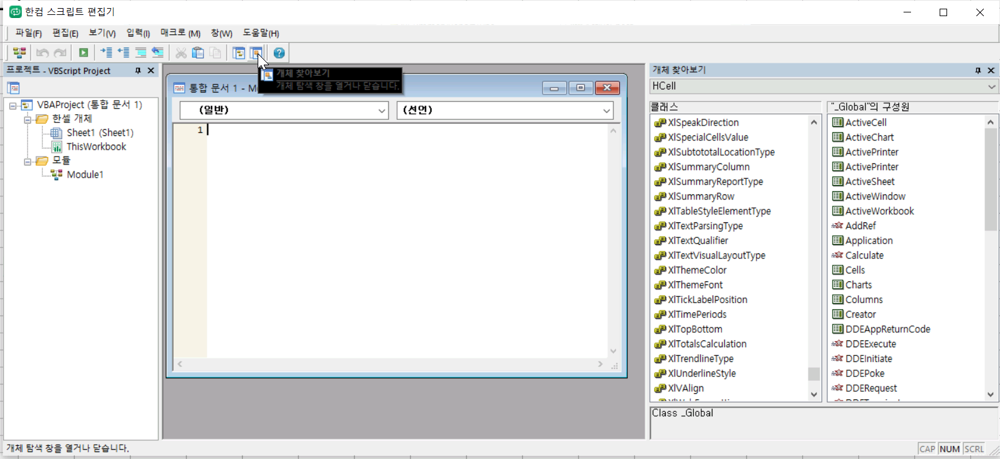

+++
date = '2024-11-27T18:08:47Z'
title = '디버깅 한셀 (0)'
weight = 100
+++

군대에서 처음 한셀을 접하게 되었고 업무 자동화를 위해 매크로를 짜게 되었다.

VB 언어를 이전에 사용해 본 적은 없고 공군 인트라넷 카페 자료를 통해 학습했는데 엑셀 ~~(도 쓴 적은 없지만)~~ 과는 다르게 상식을 벗어나는 모습을 보여 직접 파헤쳐보기로 했다.  
워낙 자료가 없기도 하고, 블랙박스 테스팅만으로 역공학하는 것이 쉽지 않기도 하고, 또 상당히 충격적인 사실들도 있어 결론을 도출하기 위해 진행한 실험들과 결과 위주로 이 '디버깅 한셀' 시리즈를 쓰려고 한다.

0편에서는 그나마 참고할 수 있는 자료와 앞으로의 분석 방법을 설명하고자 한다.

## 버전, 언어, 공식문서

{}
이 시리즈는 한컴오피스 2018을 기준으로 하고 있다.
{}

다른 버전들도 아마 동일하게 동작할 것으로 예상하지만 확인은 안 됐으니 검증이 필요한 자들은 따라해보길 추천한다.

한셀 매크로는 VBS (Visual Basic for Scripting)를 지원한다. 단, 후술하겠지만 이조차 제대로 하지 않아서 일부만 지원한다.  
참고로 엑셀은 VBA (Visual Basic for Application)를 지원한다.

Visual Basic는 Microsoft가 만든 언어인 만큼 역시 MS 자료를 제일 먼저 참고하는 것이 좋다: [https://learn.microsoft.com/en-us/previous-versions/d1wf56tt(v=vs.85)](https://learn.microsoft.com/en-us/previous-versions/d1wf56tt(v=vs.85))  
워낙 오래됐고 MS도 VBS는 별로 안 쓰기 때문에 VB/VBA랑 다르게 VBS 자료는 의외로 찾기 어려웠다.

한컴오피스에서는... 매크로 자료가 없다. 도서도 마땅한 게 안 보인다.  
인터넷 전체보다 공군 인트라넷 카페의 자료가 더 많을 정도다.

VBS의 언어 특성을 미리 설명하자면...  
- 타입 시스템: 데이터의 타입은 존재하나 변수의 타입을 지정할 수 없으며 필요시 자동으로 타입을 변환해준다 (like 야바ㄹ스크립트)
- undefined 접근 시 기본값으로 처리한다.
- 변수의 선언이 필수적이지 않다!?! --> 모듈 맨 위에 `Option Explicit`를 추가하면 `Dim x` / `ReDim x` 선언문을 강제할 수 있다.

## 실험 방법론

1. 실험의 변수를 최대한 통제하고 있는 그대로의 동작방식을 노출시키기 위해서 모든 실험에는 `Option Explicit`를 추가한다.
    - 이는 변수/상수가 정의되어 있는지 아닌지를 판별하는데 중요하다.
2. 가설을 세우고 이를 검증하거나 반증할 수 있는 제일 간단한 실험으로 입증한다.
    - 소스코드를 리버싱할 수 없기 때문에 블랙박스 테스팅밖에 할 수 없다.
    - 실험에 영향을 주는 요소가 많아질수록 원인을 특정하기 어렵기 때문에 최대한 단순해야 한다.
3. 실험으로 입증한 가설들이 모순을 보일 경우, 제일 단순한 실험으로 입증된 가설을 우선한다.
    - 단편적인 실험들로 한셀 매크로 엔진을 해석하기 위해서는 bottom-up 접근이 필요하다.

### 디버깅 기법

한셀에서 오류가 발생하면 에러 메시지에 줄 번호가 담겨있거나 메시지 창을 닫은 후 스크립트 편집기의 해당 줄로 이동시켜줄 때도 있다. 다만, 이 오류 메시지는 항상 정확하지 않으며 코드가 길어지면 전혀 관련없는 줄을 지목하거나 오류 타입조차 잘못 출력하는 경우가 있다. 심하면 한셀 프로그램이 강제종료되는 경우도 있다. 오류의 원인을 정확하게 찾아내기 위해서는 타노스 디버깅 기법을 사용해야 한다.

{}
프로그램이 정상적으로 동작할 때까지 코드를 제거하고 제거한 코드를 조금씩 복원하여 오류의 발생지점을 찾는 기법이다.
{}

## 언어 버전 및 규격 검증

MS의 공식 VBS 문서에 따르면 버전 정보는 아래의 전역 상수로 확인할 수 있다고 합니다.

{}
```vb
Option Explicit
Sub print_version()
    MsgBox ScriptEngine
    MsgBox ScriptEngineMajorVersion
    MsgBox ScriptEngineMinorVersion
    MsgBox ScriptEngineBuildVersion
End Sub
```
{}
{}
```
<변수명>(은)는 정의되지 않았습니다.
```
{}
변수 1개씩 따로 테스트해도 전부 다 정의되지 않았다는 오류가 발생합니다

### 한셀 자체적인 상수는..?

스크립트 편집기의 `개체 찾아보기` 메뉴에서는 한셀이 제공하는 객체의 매소드와 속성들을 볼 수가 있다.



이 중에 무언가가 있다면 `_Globals` 전역변수/상수/함수와 `Application` 상수가 가장 유력하다.

목록을 살펴보면 `Application.Version`, `Application.Build`가 그럴듯한데 출력해보면 한셀 제품 버전이고 이는 오른쪽 상단의 `?` 버튼으로 볼 수 있는 한셀 정보와 동일하다. 그렇다고 한셀 정보로 VBS 엔진을 검색할 수도 없으니 결국 아무 쓸모 없다.

### 구현된 기능으로 추정..?


앞에서 언급한 MS 공식 문서에는 버전별 신기능을 확인할 수 있는데 그 중 일부만 나열해보자면:

| VBS 버전 | 주요 신기능 |
| --- | --- |
| 1.0 ~ 2.0 | 대부분의 기본적인 문법과 함수 |
| 3.0 | 디버거, 콘솔 입출력 |
| 5.0 | With, Class, 정규표현식 |

한셀에서는...
- 콘솔이 없고 디버거를 사용할 수 없다
- With을 지원한다
- Class, 정규표현식은 지원하지 않는다


{}
```vb
With Range("A1")
    Msgbox .Value
End With
```
{}

{}
```vb
Class Sample
    'Empty class
End Class

Sub main()
    MsgBox "Done"
End Sub
```
{}

{}
```vb
Sub main()
    MsgBox RegExpTest("is.", "IS1 is2 IS3 is4")
End Sub

Function RegExpTest(patrn, strng)
    Dim regEx, Match, Matches   ' Create variable.
    Set regEx = New RegExp   ' Create a regular expression.
    regEx.Pattern = patrn   ' Set pattern.
    regEx.IgnoreCase = True   ' Set case insensitivity.
    regEx.Global = True   ' Set global applicability.
    Set Matches = regEx.Execute(strng)   ' Execute search.
    For Each Match in Matches   ' Iterate Matches collection.
        RetStr = RetStr & "Match found at position "
        RetStr = RetStr & Match.FirstIndex & ". Match Value is '"
        RetStr = RetStr & Match.Value & "'." & vbCRLF
    Next
    RegExpTest = RetStr
End Function
```
{}

{}
```vb
Sub main()
    MsgBox RegExpTest("is.", "IS1 is2 IS3 is4")
End Sub

Function RegExpTest(patrn, strng)
    Dim regEx, Match, Matches   ' Create variable.
    Set regEx = New RegExp   ' Create a regular expression.

    RegExpTest = ""
End Function
```
{}



{}
```
<A1 셀의 내용>
```
{}

{}
```
컴파일 오류:

_IUserForm은(는) 부모 클래스로 사용되었지만 찾을 수 없습니다.
```
{}

{}
```
컴파일 오류:

변수를 찾을 수 없습니다
```
{}

{}
```
컴파일 오류:

변수를 찾을 수 없습니다
```
{}


버전별 기능을 순차적으로 구현하지도 않았고, 한 버전의 모든 기능을 완전하게 구현하지도 않았기 때문에 언어 표준은 아무 의미가 없다.

### 그래서 언어 스펙은..?

그냥 VBS v2.0에서 fork한 문서도 없는 closed source domain-specific 언어라고 봐도 무방하다.  
공식 표준이 없기 때문에 일반적인 프로그래밍 언어의 상식조차 의심하고 검증해야 한다.
