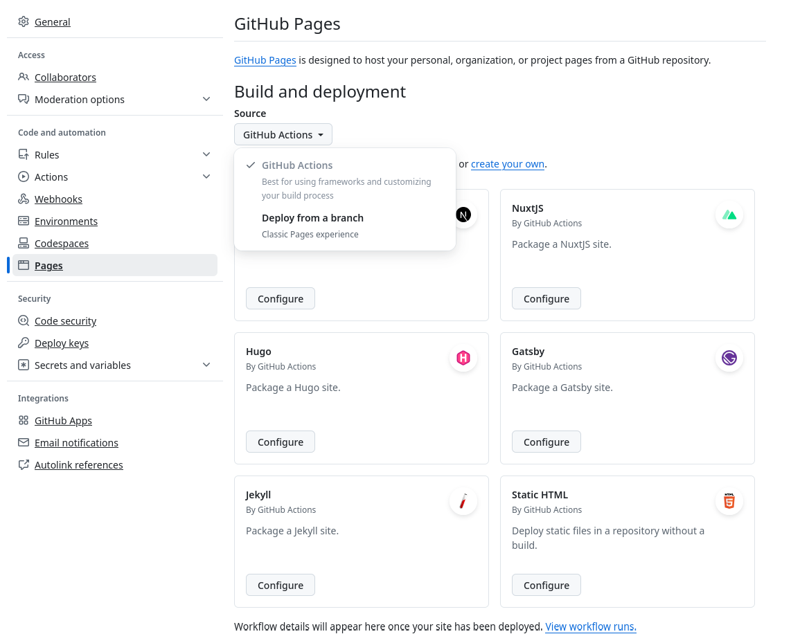

+++
date = '2024-11-17T16:08:30Z'
title = 'Relearn 설정 및 빌드'
weight = 100
+++

## Devcontainer 세팅

집에서 PC로 작업하든 깃헙 codespace로 작업하든 일정한 개발환경을 마련하기 위해 제일 먼저 devcontainer를 설정했다.

구글로 `hugo devcontainer`를 검색해서 찾은 [이 블로그](https://blog.ddavo.me/posts/tutorials/hugo-codespace/)를 참고해서 아래와 같이 `.devcontainer/devcontainer.json` 파일을 만들어줬다.

```json
{
    "name": "Hugo",
    "image": "mcr.microsoft.com/devcontainers/go",
    "features": {
        "ghcr.io/devcontainers/features/hugo:1": {
            "extended": true
        }
    },
    "customizations": {
        "vscode": {
            "extensions": ["vivaxy.vscode-conventional-commits"]
        }
    }
}
```
## 깃헙 자동배포

Jekyll은 별도의 설정 없이 자동으로 github actions가 적용되지만 다른 빌드 툴을 쓸 때는 직접 actions를 만들어줘야 한다.

{}
이때 `Repository Settings > Pages > Build and deployment`의 `Source` 설정을 `GitHub Actions`로 변경해줘야 한다.



이 작업을 하지 않으면 jekyll 빌드 action도 같이 돌아간다.
{}

몇 번의 시행착오를 거쳐 [이 블로그](https://lunarwatcher.github.io/posts/2023/08/29/hugo-on-github-pages-the-modern-alternative-for-deploying-non-jekyll-pages-to-github-pages.html)를 참고하니까 원하는대로 됐다.

`.github/workflows/deploy.yaml`
```yaml
name: Deploy pages
on:
  push:
    branches:
      - main

  # Allow manual triggering
  workflow_dispatch:

# Allow only one concurrent deployment, skipping runs queued between the run in-progress and latest queued.
# However, do NOT cancel in-progress runs as we want to allow these production deployments to complete.
concurrency:
  group: "pages"
  cancel-in-progress: false

jobs:
  build:
    runs-on: ubuntu-latest
    steps:
      - uses: actions/checkout@v4
        with:
          submodules: true
      - name: Setup Hugo
        uses: peaceiris/actions-hugo@v3
        with:
          hugo-version: 'latest'
          extended: true
      - name: Run hugo
        shell: bash
        run: |                                          # --environment 옵션이 필요한지는 모르겠다
          mkdir public
          hugo --minify --environment github
      - name: Upload artifact
        uses: actions/upload-pages-artifact@v3
        with:
          path: public/
  deploy:
    needs: build
    permissions:
      pages: write
      id-token: write
    environment:
      name: github-pages
      url: ${{ steps.deployment.outputs.page_url }}     # 없어도 되지만 deployment 탭에서 링크가 표시되지 않는다
    runs-on: ubuntu-latest
    steps:
      - name: Deploy to Github Pages
        id: deployment
        uses: actions/deploy-pages@v4
```

## URL 예쁘게 만들기

기본 설정으로 빌드하면 각 섹션의 URL에도 `index.html`이 붙는다.

예를 들면

```
/root/
|
+ - blog                -> /blog/index.html
    |
    + - projects        -> /blog/projects/index.html
        |
        + - page1.md    -> /blog/projects/page1.html
```

여기에서 `index.html`도 제거하고 각 페이지의 `.html` 확장자도 제거하기 위해서는 설정 파일 (`hugo.toml`)에 아래 내용을 추가하면 된다.
[참고자료](https://mcshelby.github.io/hugo-theme-relearn/configuration/content/linking/index.html)

```toml
[params]
  disableExplicitIndexURLs = true
```
