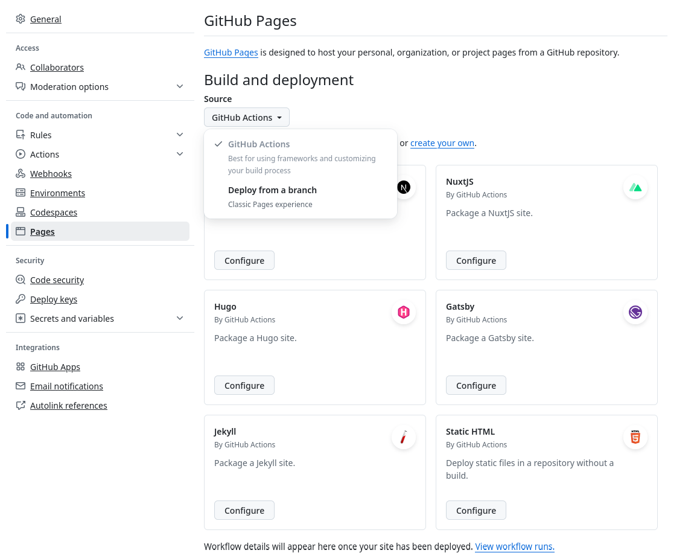

+++
date = '2024-11-17T16:08:30Z'
title = 'Relearn 설정 및 빌드'
weight = 100
+++

## Devcontainer 세팅

집에서 PC로 작업하든 깃헙 codespace로 작업하든 일정한 개발환경을 마련하기 위해 제일 먼저 devcontainer를 설정했다.

구글로 `hugo devcontainer`를 검색해서 찾은 [이 블로그](https://blog.ddavo.me/posts/tutorials/hugo-codespace/)를 참고해서 아래와 같이 `.devcontainer/devcontainer.json` 파일을 만들어줬다.

```json
{
    "name": "Hugo",
    "image": "mcr.microsoft.com/devcontainers/go",
    "features": {
        "ghcr.io/devcontainers/features/hugo:1": {
            "extended": true
        }
    },
    "customizations": {
        "vscode": {
            "extensions": ["vivaxy.vscode-conventional-commits"]
        }
    }
}
```
## 깃헙 자동배포

Jekyll은 별도의 설정 없이 자동으로 github actions가 적용되지만 다른 빌드 툴을 쓸 때는 직접 actions를 만들어줘야 한다.

{}
이때 `Repository Settings > Pages > Build and deployment`의 `Source` 설정을 `GitHub Actions`로 변경해줘야 한다.



이 작업을 하지 않으면 jekyll 빌드 action도 같이 돌아간다.
{}

몇 번의 시행착오를 거쳐 [이 블로그](https://lunarwatcher.github.io/posts/2023/08/29/hugo-on-github-pages-the-modern-alternative-for-deploying-non-jekyll-pages-to-github-pages.html)를 참고하니까 원하는대로 됐다.

`.github/workflows/deploy.yaml`
```yaml
name: Deploy pages
on:
  push:
    branches:
      - main

  # Allow manual triggering
  workflow_dispatch:

# Allow only one concurrent deployment, skipping runs queued between the run in-progress and latest queued.
# However, do NOT cancel in-progress runs as we want to allow these production deployments to complete.
concurrency:
  group: "pages"
  cancel-in-progress: false

jobs:
  build:
    runs-on: ubuntu-latest
    steps:
      - uses: actions/checkout@v4
        with:
          submodules: true
      - name: Setup Hugo
        uses: peaceiris/actions-hugo@v3
        with:
          hugo-version: 'latest'
          extended: true
      - name: Run hugo
        shell: bash
        run: |                                          # --environment 옵션이 필요한지는 모르겠다
          mkdir public
          hugo --minify --environment github
      - name: Upload artifact
        uses: actions/upload-pages-artifact@v3
        with:
          path: public/
  deploy:
    needs: build
    permissions:
      pages: write
      id-token: write
    environment:
      name: github-pages
      url: ${{ steps.deployment.outputs.page_url }}     # 없어도 되지만 deployment 탭에서 링크가 표시되지 않는다
    runs-on: ubuntu-latest
    steps:
      - name: Deploy to Github Pages
        id: deployment
        uses: actions/deploy-pages@v4
```

## URL 예쁘게 만들기

기본 설정으로 빌드하면 각 섹션의 URL에도 `index.html`이 붙는다.

예를 들면

```
/root/
|
+ - blog                -> /blog/index.html
    |
    + - projects        -> /blog/projects/index.html
        |
        + - page1.md    -> /blog/projects/page1.html
```

여기에서 `index.html`도 제거하고 각 페이지의 `.html` 확장자도 제거하기 위해서는 설정 파일 (`hugo.toml`)에 아래 내용을 추가하면 된다.
[참고자료](https://mcshelby.github.io/hugo-theme-relearn/configuration/content/linking/index.html)

```toml
[params]
  disableExplicitIndexURLs = true
```

## 사이드바 메뉴 정렬하기

모든 설정이 끝났을 거라고 생각하고 이 글을 작성했더니 좌측 사이드바 메뉴에서 최신순으로 글이 나열된 것을 발견했다.

오래된순으로 나열되기를 원해 방법을 찾기 시작했다. 물론, 직접 매번 `weight`를 지정하면 원하는대로 정렬이 가능하지만, 그건 너무 번거롭다.

{}
이 테마가 지원하는 정렬 방법은 [여기](https://mcshelby.github.io/hugo-theme-relearn/configuration/sidebar/menus/index.html#ordering-menu-entries)에 나와있다.
{}

이 설정은 한 가지 값만 받기 때문에 2가지 기준을 적용하는 유일한 값은 `default`였다. 하지만 Hugo의 `default`는 동일 `weight`에 대해 최신순으로 정렬한다.

원하는 대로 정렬하는 기능을 추가하기 위해서는 기본 레이아웃을 덮어써야 했다.

우선, 최상위 정렬 설정명은 `params.ordersectionsby`이므로 Relearn 레포지토리에서 [검색을 했다](https://github.com/search?q=repo%3AMcShelby%2Fhugo-theme-relearn%20params.ordersectionsby&type=code).

발견된 파일은 단 1개: `layouts/partials/_relearn/pages.gotmpl`

이 파일을 동일한 경로에 저장한 다음, 아래의 내용을 추가했다.
[참고자료](https://discourse.gohugo.io/t/sort-posts-by-weight-then-by-title/44937/2)

```diff
@@ -23,8 +23,14 @@
 {{- else if eq $by "length" }}
        {{- $pages = $page.Pages.ByLength }}
 {{- else if eq $by "default" }}
        {{- $pages = $page.Pages }}
+{{- else if eq $by "weighted-old"}}                        # 새로운 정렬 옵션명: "weighted-old"
+       {{- range $page.Pages.GroupBy "Weight" }}
+               {{- range .Pages.ByDate}}
+                       {{- $pages = $pages | append . }}
+               {{ end }}
+       {{ end }}
 {{- else }}
        {{- warnf "%q: Unknown pages sort order '%s'" $page.File.Filename }}
        {{- $pages = $page.Pages }}
 {{- end }}
```

{}
`layouts/partials/pages.gotmpl`에 만들면 동작하지 않고 빌드 오류가 발생한다.

반드시 `layouts/partials/_relearn/pages.gotmpl`에 변경된 레이아웃 파일을 저장해야 한다.
{}

{}
[공식문서](https://mcshelby.github.io/hugo-theme-relearn/configuration/customization/partials/index.html)에서 안전하게 변경해도 되는 파일 목록에 포함되어 있지 않으므로 업데이트 시 주의해야 하며
이 테마의 버전을 직접 지정하는 것을 추천한다.

`go.sum` 삭제 이후 `hugo mod get -u github.com/McShelby/hugo-theme-relearn@<release tag>` 명령어를 실행해 버전을 지정한다.

예: `hugo mod get -u github.com/McShelby/hugo-theme-relearn@7.1.1`
{}
