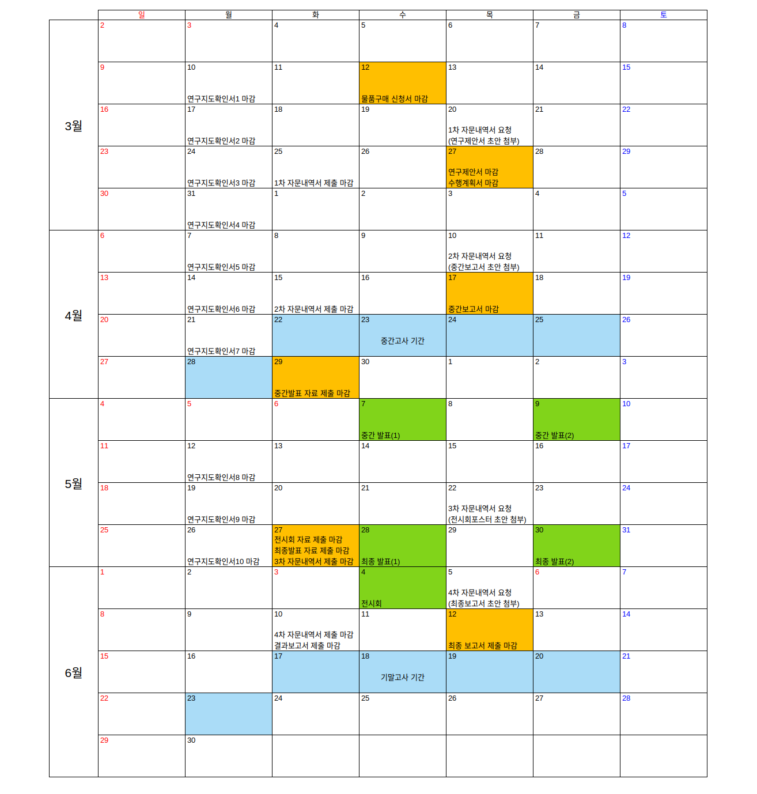

+++
date = '2025-06-17T13:29:43Z'
title = '개요'
weight = 100
+++

## 졸업연구

이 수업은 학과의 여러 랩실에서 제시하는 주제 중 하나를 선택해 한 학기동안 연구하고 발표하는 전공 수업이다. 올해 25년부로 여러가지가 바뀌어 졸업 요건이 2학기 -> 1학기로 줄고, 4인1조로 진행되었다.

## 주제

원래는 다른 주제를 하려고 했지만 이미 마감되어 대신 역으로 제안받은 주제 중 `바이너리 최적화를 통한 webOS 부팅 최적화`를 선택하게 되었다.

이전의 학부인턴과 오픈소스컨트리뷰션 경험으로 tracing에 대한 사전지식이 있었고 학부인턴 중 바이너리 영역의 재배치가 linker script로 가능하다는 말을 지나가듯 들은 적이 있었다. 그래서 `tracing + linker script`라는 로드맵이 보였기 때문에 이 주제를 선택하게 되었다. 그리고 자연스럽게 팀장이 되었다. ~~(그러면 안 됐는데...)~~

## 연구 방법

1. 바이너리 최적화 대상 선정 --> webOS 커널
2. 부팅 과정의 함수 호출 tracing (ftrace)
3. Trace 데이터 기반으로 `.text` 영역을 재배치하는 링커 스크립트 생성
4. 링커 스크립트를 적용해 커널 재빌드
5. 벤치마킹

## Bitbake Hell

이번 연구에서 `Bitbake` 빌드 시스템을 처음 접했고 너무나도 끔찍했다.

여태까지 접한 모든 빌드 시스템은 현재 working directory를 기준으로 코드를 컴파일하는데 bitbake는 외부 repository를 기준으로 소스를 불러와서 빌드한다. 따라서 로컬에서 파일을 수정하면 `bitbake가 upstream 코드로 초기화`시키기 일수였다.

거기에 더해 처음에는 bitbake에 익숙하지 않아 빌드 캐시까지 날려먹어 `28.5시간`의 클린 빌드를 2번이나 해야되는 불상사까지 발생했다. 이때 빌드 중 컴퓨터는 아예 사용하지 못하고 있었다. (사용하면 메모리 부족으로 컴파일 실패 또는 빌드 시간 증가...)

개발 편의성을 높이기 위해 `devtools`가 생기긴 했지만, `webOS의 프로젝트 구조가 표준 구조를 따르지 않기` 때문에 devtools가 정상적으로 동작하지 않았고 GPT/Gemini도 환각이 심했다. 심지어 후반에 가서는 devtools가 동작하게끔 `성공한 줄 알았는데` layer 적용 순서에 문제가 생겼었는지 변경사항이 `전혀 반영되지 않았던`  문제도 있었다. 이때 별다른 에러가 없어서 성공한 줄 알았다가 기존 빌드 파일과 크기가 같아 diff를 해보니 동일하다는 결과에 좌절했었다.

Bitbake 공식 문서는 가장 기본적인 표준 프로젝트 구조를 전제로 설명하기 때문에 webOS에는 대응이 되지 않았다. Config 값을 변수로 두고 설명한 것도 아니고, 여러 레이어 간 공유되는 빌드 캐시에 대한 설명도 없고, /r/yocto 및 /r/embeddedlinux subreddit을 봐도 직접 부딪히며 조금씩 시행착오를 거치는 것이 bitbake를 배우는 최선의 방법이라고 할 정도로 `참고 자료가 부실했다.`

실제로 이 프로젝트를 수행하며 쓴 전체 시간 중 절반 이상이 `bitbake`가 변경사항을 초기화하지 않고 빌드만 하게 만드는데 사용됐다. 연구 목적이나 최종 결과에는 아무 의미도 없는 구현 디테일에 계속 발목을 잡혔다.

## 일정

다 끝나고 돌아보니 애초에 시간이 많지 않았다. 최종 발표까지 모든 작업을 끝내야 하는데 보고서 / 발표 때문에 연구에 집중할 수 있는 실질적인 기간은 대략 6주 밖에 안 된다. 그리고 이걸 로드 많은 수업 2개(운영체제 w/ xv6 + GPU 프로그래밍)과 병행해야 했다. ~~이게 진심으로 연구를 하라는 스케줄인가???~~ 하지만 이런 일정의 촉박함을 초기에 파악하지 못해 몇 가지의 일정관리 미쓰가 발생했고, 이것 때문에 학기 내내 시간에 쫒기게 되었다.

### 일정관리 Miss

1. 첫 미팅에서 갑자기 주제가 2가지로 늘어났다

- 코드 재배치를 통한 바이너리 최적화
- mmap file IO의 prepaging

Prepaging 주제가 추가되면서 4월 2주차까지 팀원들의 연구시간이 분산되어 진척이 거의 없었다. 2명은 코드 재배치를 위해 `function tracing + linker script`를 조사했고, 2명은 `mmap` tracing을 위해서 `kprobes / ebpf filter`를 찾아봤다.

2. 3월 말에 Raspberry Pi가 올 때까지 개발을 본격적으로 시작하지 않았다

라즈베리 파이가 오기를 기다리며 background research 및 research plan에 너무 많은 시간을 낭비했다. 코드 재배치를 user space에서 먼저 실험해보는 등 기기가 없어도 할 수 있는 작업들이 있었음에도 불구하고 제일 시간이 많을 학기 초를 효율적으로 활용하지 못했다.

3. Bitbake로 너무 많은 시간이 소모됐고 자문 요청도 잘 활용하지 못했다.

연구실을 통해 LG의 webOS 관련 현직자를 산학협력 멘토로 섭외할 수 있어 학기 중 총 4면의 자문을 받게 되었다. 이때 1~2회차 자문에서 빌드 시스템에 대해 문의를 드렸다면 도움이 되는 답변을 받을 수 있었을 것이다. 하지만 위 2가지의 사유로 bitbake를 빌드만 하는 것이 아닌 `코드 수정을 시도해볼 정도로 진전된 것은 2차 자문 요청이 끝난 뒤`였고, 3차 자문의 답변을 기다리면 제출 기한 내 결과물을 낼 수가 없어 혼자서 부딪치며 방법을 찾을 수밖에 없었다.

*요약하자면 해야 할 작업들의 소요시간을 정확히 예측하지 못한 채 목표를 높게 잡았다가 후폭풍을 맞았다.*

### 일정관리 복구

1. `mmap prepaging`을 포기하고 코드 재배치로 연구 범위 축소

처음에 들은 설명으로는 `mmap prepaging`은 선행 연구로 구현이 완료되어 trace 데이터만 얻으면 라이브러리를 호출하듯 plug and play가 되는 줄 알았다. `mmap file`의 바이트 단위 IO를 탐지하는 방법을 조사한 바에 따르면 이것만으로도 쉽지 않아 보여 조금 빠듯할 것 같았다.

하지만 4월이 되고 나서는 `prepaging`까지 직접 구현해야 된다는 듯한 말을 듣고, 또 남은 일정을 확인하고는 시간 내 두 주제를 수행할 수 없다고 판단해 `prepaging` 주제를 포기했다.

2. 연구를 더 주도적으로 이끌면서 페이스 상승

초반에는 미팅에서 배경지식과 선행 연구 등 주제에 관해 지도를 받고 1주일동안의 할 일을 전달받았다.

`Prepaging`을 버리고 본격적인 구현 작업에 착수하면서부터 지도받는 것의 의존도를 낮추고 각 팀원들의 진행도에 맞춰 다음 할 일을 레퍼런스와 함께 구체적으로 지정해줬다. 그 결과 매주 가시적인 성과가 나왔고 그를 토대로 미팅을 더 생산적으로 진행하며 작업 페이스가 올라갔다.

3. 팀원들은 `Bitbake`를 배제하고 다른 코드 베이스에서 PoC 작업 진행을 지시

- `ftrace`로 부팅 중 커널 함수를 tracing하는 작업을 우선 `RaspberryPi OS`에서 시도했다
- 예제 C 프로그램을 만들어 `userspace에서` 링커 스크립트로 코드를 재배치하는 방법을 `미리 연습`했다
- 최악의 사태를 대비해 연구 대상을 아예 `RPi OS` 커널로 변경하는 것도 고려했다
    - 최종 발표를 1주일도 안 남긴 시점에서 둘을 병렬로 작업하다가 `webOS`에 적용하는 것을 성공해 `RPi OS`는 결국 사용하지 않았다

## 회고

팀장으로서, 그리고 관련 배경지식이 있던 유일한 사람으로서 프로젝트를 진행하는데 매우 힘들었다.

배경지식으로는 `로드맵이 안 보이던 작업들은 mmap file tracing + prepaging과 bitbake 빌드 시스템`이었다. 그 외에는 대략적으로 무엇을 해야 하는지 그려졌고, 실제로도 거의 그대로 작업이 진행됐다. 연구주제를 선택한 만큼 그 결정을 따라준 `팀원들에 대한 배려로 로드맵이 보이는 작업들은 팀원들에게 양보하고` 제일 어려워 보이는 작업들을 자청했다. 그래서 남은 `mmap file tracing + bitbake 빌드 시스템을 담당`하게 되었다.

팀원들에게 일을 배정할 때는 참고 자료와 단계를 제시하고 매주 미팅에서 팀원들의 진행상황을 확인하고 다음 단계를 제시했었다. 작업 중 막히는 부분이 생기면 문제를 해결하기 위해 도와주기까지 해서 혼자서만 업무분담이 안 이루어졌다. 결국 `tracing을 제외한 나머지 구현은 혼자 작업`하게 됐고 다른 팀원들에게는 발표 및 보고서 준비를 맡기게 됐다.

덤으로 매주 담당 조교님과의 미팅 요약을 포함하는 확인서를 챙기고 공지 및 과제물 제출 일정을 확인하는 등의 `행정처리도, 발표 자료의 최종 검토도 하다보니` 정신이 없었다. 

이번이 첫 팀 프로젝트도 아니고 팀장이었던 것도 두 번째라 `이전에 비해 시간 내 목표를 설정하고 달성하는 것은 더 능숙해졌다.` 하지만 구현에 한해서는 다른 팀원에게 맡겼다가도 결국 다시 되돌아와서 혼자 너무 큰 부담을 안아버려 `업무를 분배하고 팀원들이 각자의 일을 책임지도록 리드하는 부분은 많이 부족하다고 느꼈다.` 그리고 일을 맡길 때는 마무리를 확인하는 것을 단 한 번만 빼먹어도 큰 사고로 이어질 수 있다는 것을 절실히 깨달았다.
